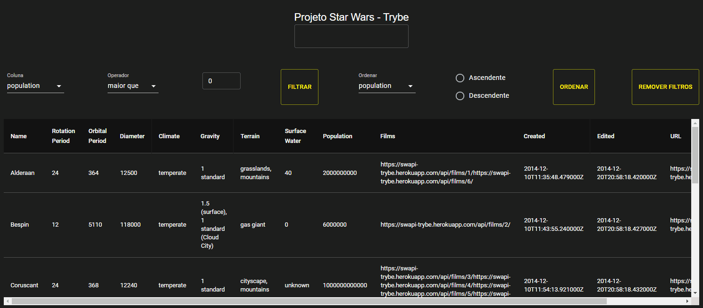

# Welcome to the Star Wars Planets Search project repository!

### README Translations:

-   [English](/README.en.md)
-   [Portuguese](/README.md)

* * *

## 👨‍💻 What was developed:

-   I developed a filter list of planets from the Star Wars universe using Context API and Hooks to control global states.

:bulb:**See a sample below:**



## Skills used:

-   Use React's Context API to manage state.
-   Use a React Hook useState;
-   Utilizar o React Hook useContext;
-   Utilizar o React Hook useEffect;
-   Create custom React Hooks.
-   Write tests to ensure the application has good test coverage.

# requirements

* * *

## 1 - Make a request to the endpoint`/planets`from the Star Wars API and populate a table with the returned data, with the exception of the column data`residents`

> :eyes: Note: To avoid errors in the evaluator, when preparing your work environment to use the Context API, it is necessary that the`<Provider>`be used inside the component`App.js`and not in the file`index.js`. This guidance is for the sole purpose of testing this project.

<details><summary> Ilustração da tabela:</summary>


</details><br />

<details><summary> A tabela deve ser renderizada por um componente chamado <code>Table</code>:</summary>

-   You must delete the column`residents`of each planet before saving the data received from the API in context.
-   The request must be made in a separate component from the table component.
-   The API to be queried is[in this link](https://swapi.dev/api/planets). You must fetch the URL`https://swapi.dev/api/planets`.
-   The first row of the table must contain the headers of each column. The other lines will be the information of each planet received from the API.
    </details>

<br /><details>

  <summary><strong>O que será verificado</strong></summary><br />

-   Makes a request to the API;
-   Populates the table with the returned data;
-   Checks if the table has 13 columns;
-   Checks if the table has a row for each planet returned.
    </details>

* * *

## 2 - Create a text filter for the table

<details><summary> A tabela deve ser atualizada com os planetas que se encaixam no filtro à medida que o nome é digitado, sem ter que apertar em um botão para efetuar a filtragem. Por exemplo, se for digitado "Tatoo" no campo de texto, o planeta "Tatooine" deve ser exibido, como demonstrado na <b>ilustração</b>:</summary>


</details><br />

<details><summary>Observações técnicas</summary>

-   You should use**Context API e Hooks**to manage application state;
-   The text field must have the property`data-testid='name-filter'`for automated assessment to work;
-   <details><summary> O texto digitado deve ser salvo num campo <code>{ filterByName: { name } }</code>. Por exemplo:</summary>

        ```javascript
        {
          filterByName: {
            name: 'Tatoo'
          }
        }
        ```

      </details>
    </details>

<br /><details>

  <summary><strong>O que será verificado</strong></summary><br />

-   Renders the text field for the name filter;
-   Filters for planets that have the letter "o" in their name;
-   Filters for planets that have the letter "o" in their name;
-   Performs the two filters above in sequence and after, tests the removal of the filter by text.
    </details>

* * *

## 3 - Create a filter for numeric values

<details><summary> O filtro funcionará com três seletores:</summary>

-   The first should open a dropdown that allows users to select one of the following columns:`population`,`orbital_period`,`diameter`,`rotation_period`e`surface_water`. must be a tag`select`with the property`data-testid='column-filter'`;
-   The second must determine whether the value range will be`maior que`,`menor que`or`igual a`the number that will come next. a tag`select`with the property`data-testid='comparison-filter'`;
-   The third should be a text box that only accepts numbers. This box must be a tag`input`with the property`data-testid='value-filter'`;
-   There must be a button to trigger the filter, with the property`data-testid='button-filter'`
    </details>

<details><summary> A combinação desses três seletores, ao clicar no botão, deve filtrar os dados da tabela de acordo com a coluna correspondente e com os valores escolhidos. Por exemplo:</summary>

-   The selection`population | maior que | 100000`- Select only planets with more than 100000 inhabitants.
-   The selection`diameter | menor que | 8000`- Selects only planets smaller than 8000 in diameter.
    </details>

<details><summary><b>Ilustração do filtro:</b></summary>


</details><br />

<details><summary>Observações técnicas</summary>

-   You should use**Context API e Hooks**to manage application state;
-   <details><summary> No contexto, esses valores devem ser salvos em um outro campo <code>{ filterByNumericValues: [{ column, comparison, value }] }</code>. Por exemplo:</summary>

        ```javascript
        {
          filterByNumericValues: [
            {
              column: 'population',
              comparison: 'maior que',
              value: '100000',
            }
          ]
        }
        ```

    </details>

<br /><details>

  <summary><strong>O que será verificado</strong></summary><br />

-   Renders the column select and its options;
-   Renders the compare select and its options;
-   Renders the input to the filter value;
-   Renders the button to perform filtering;
-   Checks if the initial values ​​of each field are (`population`\|`maior que`\|`0`);
-   Use the filter button without changing the initial values ​​of the filter inputs;
-   Filters using the "less than" comparison;
-   Filters using the "greater than" comparison;
-   Filters using the "equals" comparison.
    </details>

* * *

## 4 - Implement multiple numeric filters

<details><summary> Deverá ser possível adicionar múltiplos filtros numéricos. Todos os filtros adicionados devem funcionar de forma conjunta:</summary>


</details><br />

For example, you can filter by planets that have_Orbital period greater than 400_**e**_Diameter less than 10000_.

<br /><details>

  <summary><strong>O que será verificado</strong></summary><br />

-   Adds two filters and checks if the table has been updated with the filtered information;
-   Adds three filters and checks if the table has been updated with the filtered information.
    </details>

* * *

## 5 - Develop tests to achieve 30% full application coverage

> :eyes: Note: In this requirement we will cover the application with unit tests using the library[React Testing Library](https://testing-library.com/docs/react-testing-library/intro/), take this opportunity to put into practice the[Test Driven Development](https://blog.betrybe.com/tecnologia/tdd-test-driven-development/).

<details><summary>Observações técnicas</summary>

-   The tests you create will not influence the other requirements in the evaluator. You will develop your unit/integration tests using the React Testing Library, while the evaluator will use the library[Cypress](https://docs.cypress.io/)to assess requirements, including coverage requirements.
    </details><br />

<br /><details>

  <summary><strong>O que será verificado</strong></summary><br />

-   It will be validated if, when executing`npm run test-coverage`, the following results are obtained:
          * `% Stmts` da linha `All files` é maior ou igual a 30.
          * `% Branch` da linha `All files` é maior ou igual a 30.
          * `% Funcs` da linha `All files` é maior ou igual a 30.
          * `% Lines` da linha `All files` é maior ou igual a 30.
    </details>

* * *

## 6 - Do not use repeated filters

<details><summary> Caso um filtro seja totalmente preenchido, um novo filtro de valores numéricos deve ser carregado.</summary>

-   This new filter must not include any columns that have already been selected in previous numeric value filters;
-   If all columns have already been included in previous filters, a new filter must not be loaded;
-   You should use**Context API e Hooks**to manage the application state.
    </details>

<details><summary> Ilustração:</summary>


</details><br />

<details><summary> Exemplo:</summary>

-   The first filter has the following selections:`population | maior que | 100000`;
-   A second filter should appear after these selections are all made;
-   In the first dropdown of this second filter, the option`population`must be absent;
-   <details><summary> Se no segundo filtro fosse selecionado `diameter | menor que | 8000`, o estado ficaria assim:</summary>

    ```javascript
    {
      filterByNumericValues: [
        {
          column: 'population',
          comparison: 'maior que',
          value: '100000',
        },
        {
          column: 'diameter',
          comparison: 'menor que',
          value: '8000',
        }
      ]
    }
    ```

    </details>

<br /><details>

  <summary><strong>O que será verificado</strong></summary><br />

-   Filter by population and remove option`population`from the filter by column dropdown options.
    </details>

* * *

## 7 - Delete a numeric value filter by clicking on the icon`X`of one of the filters and clear all numerical filters simultaneously by clicking on another control button.`Remover todas filtragens`

-   <details><summary> O <code>button</code> que permite exclusão de um filtro deve existir em todos os filtros de valores numéricos:</summary>

    -   Each line that demonstrates the filter already used must have the property`data-testid='filter'`, common`button`which must be a direct child of the tag where the`data-testid='filter'`;
    -   After the exclusion, the column that this filter selected should become available in the dropdowns of the other filters already present on the screen;
    -   You should use**Context API e Hooks**to manage the application state.
    -   <details><summary> Exemplo:</summary>

            ```html
            data-testid='filter'
                ⬑ column
                ⬑ comparison
                ⬑ value
                ⬑ button
            ```

          </details>
        </details>


-   O`button`of`Remover todas filtragens`must possess the`data-testid='button-remove-filters'`. It is`button`will be responsible for removing all numeric filters simultaneously.

<details><summary> Ilustração do requisito:</summary>


</details>

<br /><details>

  <summary><strong>O que será verificado</strong></summary><br />

-   Adds a filter and checks if the table has been updated with the filtered information, then removes the filter and checks if the table values ​​are back to the original.
-   Adds two filters and checks if the table has been updated with the filtered information, then removes the filters and checks if the table values ​​are back to the original.
-   Adds three filters and checks if the table has been updated with the filtered information, then removes the filters using the button`button-remove-filters`and checks if the table values ​​returned to the original.
    </details>

* * *

## 8 - Develop tests to achieve 60% full application coverage

<details><summary>Observações técnicas</summary>

-   The tests you create will not influence the other requirements in the evaluator. You will develop your unit/integration tests using the React Testing Library, while the evaluator will use the library[Cypress](https://docs.cypress.io/)to assess requirements, including coverage requirements.
    </details><br />

<br /><details>

  <summary><strong>O que será verificado</strong></summary><br />

-   It will be validated if, when executing`npm run test-coverage`, the following results are obtained:
        * `% Stmts` da linha `All files` é maior ou igual a 60.
        * `% Branch` da linha `All files` é maior ou igual a 60.
        * `% Funcs` da linha `All files` é maior ou igual a 60.
        * `% Lines` da linha `All files` é maior ou igual a 60.
    </details>

* * *

# Bonus Requirement

## 9 - Sort the columns ascending or descending

-   Sorting must be done via filter: a dropdown will select the column to base the sorting on and a pair of radio buttons will determine whether it is ascending or descending.

-   <details><summary> A informação acerca da ordenação das colunas deve ser armazenada em um novo campo <code>{ order: { column: 'population', sort: 'ASC'} }</code>:</summary>

    -   The field`column`represents the name of the column to sort;
    -   The field`sort`represents the ordering, being 'ASC' ascending and 'DESC' descending;
        </details>

-   <details><summary> O dropdown deve ser um elemento <code>select</code>:</summary>

    -   O`dropdown`need to own the property`data-testid='column-sort'`;
    -   <details><summary> As colunas selecionáveis através deste <code>dropdown</code> são:</summary>

            - 'population';
            - 'orbital_period';
            - 'diameter';
            - 'rotation_period';
            - 'surface_water'.
            </details>

        </details>

-   <details><summary> É necessário ter dois <code>inputs</code> de tipo <code>radio</code>:</summary>

    -   The first must have the attribute`data-testid='column-sort-input-asc'`e`value`being`ASC`;
    -   The second must have the attribute`data-testid='column-sort-input-desc'`e`value`being`DESC`;
        </details>

-   :eyes: If the sorted column has planets with values`unknown`, you must order them so that values`unknown`will be placed last in the ranking.

-   Finally, create a button to submit the sort, with a tag`button`and the property`data-testid='column-sort-button'`.

-   add the attribute`data-testid`with the value`planet-name`on all elements of the table that have the name of a planet.

<details><summary><b> Ilustração do requisito:</b></summary>


</details>

<br /><details>

  <summary><strong>O que será verificado</strong></summary><br />

-   Orders the planets from highest orbital period to lowest orbital period;
-   Order the planets from smallest diameter to largest diameter;
-   Order the planets from least populous to most populous;
    -   Checks if the first eight planets are ordered correctly;
    -   Checks if the last two planets have unknown values ​​in the population column.
-   Order the planets from most populous to least populous;
    -   Checks if the first eight planets are ordered correctly;
    -   Checks if the last two planets have unknown values ​​in the population column.

</details>

* * *

## 10 - Develop tests to achieve 90% full application coverage

<details><summary>Observações técnicas</summary>

-   The tests you create will not influence the other requirements in the evaluator. You will develop your unit/integration tests using the React Testing Library, while the evaluator will use the library[Cypress](https://docs.cypress.io/)to assess requirements, including coverage requirements.
    </details><br />

<br /><details>

  <summary><strong>O que será verificado</strong></summary><br />

-   It will be validated if, when executing`npm run test-coverage`, the following results are obtained:
        * `% Stmts` da linha `All files` é maior ou igual a 90.
        * `% Branch` da linha `All files` é maior ou igual a 90.
        * `% Funcs` da linha `All files` é maior ou igual a 90.
        * `% Lines` da linha `All files` é maior ou igual a 90.
    </details>
